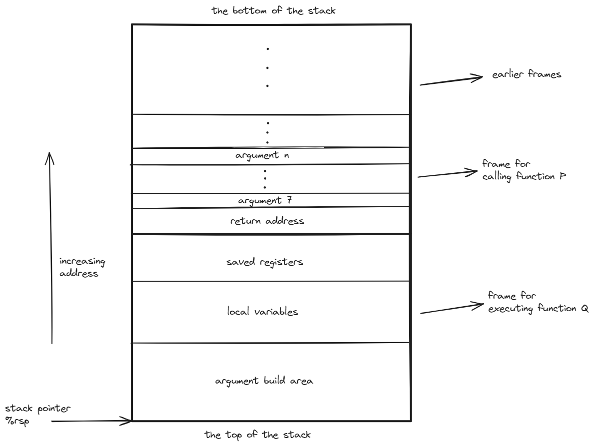

# 程序的机器级别表示

本章基于 x86-64 架构，介绍机器级程序的表示、处理器读取和解释存储在存储器中的指令的方式，以及如何编写能够有效利用处理器和内存系统的高速缓存的 C 程序.

## 程序编码

gcc 命令转化源代码为可执行代码：

- C 预处理器扩展源代码，插入所有用 #include 指定的文件，并扩展所有用 #define 定义的宏.
- 编译器产生源代码的汇编代码.
- 汇编器将汇编代码转化为机器代码的目标代码.
- 链接器将目标代码与实现标准 C 函数库的代码合并，以及启动代码，最终生成可执行代码.

x86-64 显示的处理器状态包括：

- 程序计数器 PC，给出将要执行的下一条指令在内存中的地址.
- 整数寄存器文件，包含 16 个命名的位置，分别存放 64 位的值.
- 条件码寄存器，记录最近执行的算术或逻辑指令的状态信息.
- 向量寄存器文件，包含 32 个 128 位的位置，分别存放一个特殊的值，称为向量.

### 一个实例

```c
// mstore.c
long mult2(long, long);

void multstore(long x, long y, long *dest) {
    long t = mult2(x, y);
    *dest = t;
}
```

我们运行 gcc 命令 `gcc -Og -S mstore.c`，得到的汇编代码包括如下部分：

```asm
multstore:
	pushq	%rbx
	movq	%rdx, %rbx
	call	mult2@PLT
	movq	%rax, (%rbx)
	popq	%rbx
	ret
```

而如果我们使用 `gcc -Og -c mstore.c`，得到的是二进制文件 `mstore.o`，组成成分为十六进制机器码，我们可以利用 gdb 来查看。用 gdb 运行文件 `msotre.o`，并输入命令 `x/14xb multstore`，就能获取自函数 `multstore` 所处地址开始的 14 个字节的十六进制表示。 

而需要从机器代码获取汇编代码，我们需要使用反汇编器。objdump 反汇编器可以将二进制文件转化为汇编代码，命令 `objdump -d mstore.o`，得到的结果如下：

```asm
0000000000000000 <multstore>:
   0:   f3 0f 1e fa             endbr64 
   4:   53                      push   %rbx
   5:   48 89 d3                mov    %rdx,%rbx
   8:   e8 00 00 00 00          call   d <multstore+0xd>
   d:   48 89 03                mov    %rax,(%rbx)
  10:   5b                      pop    %rbx
  11:   c3                      ret    
```

此外，在 gdb 中，我们可以使用 `disassemble` 命令来反汇编函数。

以下是一些关于机器代码和其反汇编表示的特性：

- x86-64 的指令长度从 1 到 15 个字节不等。常用的字节数较少，不常用的字节数较多。
- 设置指令格式的方式是，从某个给定位置开始，可以将字节唯一地解码成机器指令。例如只有 `pushq %rbx` 是以字节值 53 开头的。
- 反汇编只是基于机器代码文件中的字节序列来确定汇编代码，其不需要访问该程序的源代码或者编译器产生的汇编代码。
- 反汇编器使用的指令命名规则与 gcc 生成的汇编代码使用的规则有细微的差别。

生成实际可执行的代码需要对一组目标代码文件运行链接器，而这一组目标代码文件中必须包含一个 main 函数，设我们的 `main.c` 中包含如下代码：

```c
// main.c
#include<stdio.h>

void multstore(long, long, long *);

int main() {
    long d;
    multstore(2, 3, &d);
    printf("2 * 3 --> %ld\n", d);
    return 0;
}

long mult2(long a, long b) {
    long s = a * b;
    return s;
}
```

然后我们运行 `gcc -Og -o prog main.c mstore.c`，得到可执行文件 `prog`，运行 `objdump -d prog`，得到的结果包括：

```asm
00000000000011d8 <multstore>:
    11d8:       f3 0f 1e fa             endbr64 
    11dc:       53                      push   %rbx
    11dd:       48 89 d3                mov    %rdx,%rbx
    11e0:       e8 e7 ff ff ff          call   11cc <mult2>
    11e5:       48 89 03                mov    %rax,(%rbx)
    11e8:       5b                      pop    %rbx
    11e9:       c3                      ret    
```

其与我们先前对 `mstore.o` 进行反汇编的结果大致相同，但是有一些细微的差别，例如 `call` 指令的目标地址填充为调用 `mult2` 的地址。

```asm
	.file	"mstore.c"
	.text
	.globl	multstore
	.type	multstore, @function
multstore:
.LFB0:
	.cfi_startproc
	endbr64
	pushq	%rbx
	.cfi_def_cfa_offset 16
	.cfi_offset 3, -16
	movq	%rdx, %rbx
	call	mult2@PLT
	movq	%rax, (%rbx)
	popq	%rbx
	.cfi_def_cfa_offset 8
	ret
	.cfi_endproc
.LFE0:
	.size	multstore, .-multstore
	.ident	"GCC: (Ubuntu 11.4.0-1ubuntu1~22.04) 11.4.0"
	.section	.note.GNU-stack,"",@progbits
	.section	.note.gnu.property,"a"
	.align 8
	.long	1f - 0f
	.long	4f - 1f
	.long	5
0:
	.string	"GNU"
1:
	.align 8
	.long	0xc0000002
	.long	3f - 2f
2:
	.long	0x3
3:
	.align 8
4:
```

`.` 开头的行是指导汇编器和链接器工作的伪指令，通常可以被忽略，而且其也没有指明指令的用途以及其和源代码之间的关系。

??? example "伪指令说明"
    - `.file` 指令指出了源代码文件的名称. 
    - `.text` 指令指出了接下来的指令都是代码. 
    - `.globl` 指令指出了接下来的符号是全局可见的. 
    - `.type` 指令指出了 `multstore` 是一个函数，`.LFB0` 和 `.LFE0` 指令指出了函数的开始和结束，`.cfi_startproc` 和 `.cfi_endproc` 指令指出了函数的开始和结束，`.size` 指令指出了函数的大小.
    - `.ident` 指令指出了编译器的版本.
    - `.align` 指令指出了接下来的指令的地址需要对齐.
    - `.long` 指令指出了接下来的指令是一个 4 字节的值，`.string` 指令指出了接下来的指令是一个字符串。

所以我们通常用以下的格式来表示汇编代码：

```asm
; void multstore(long x, long y, long *dest) 
; x in %rdi, y in %rsi, dest in %rdx
multstore:
    pushq   %rbx ; save %rbx
    movq    %rdx, %rbx ; copy dest to %rbx
    call    mult2 ; mult2(x, y)
    movq    %rax, (%rbx) ; store result at *dest
    popq    %rbx ; restore %rbx
    ret ; return
```

??? tip
    以上我们使用的都是 AT&T 格式的汇编代码，其与 Intel 格式的汇编代码有一些细微的差别。我们可以利用 `gcc -Og -S -masm=intel mstore.c` 来生成 Intel 格式的汇编代码。包含以下内容：

    ```asm
    multstore:
        push	rbx
        mov	rbx, rdx
        call	mult2@PLT
        mov	QWORD PTR [rbx], rax
        pop	rbx
        ret
    ```

## 数据格式

因为是从 16 位操作系统扩展到 32 位操作系统的，所以 Intel 用术语 word 来表示 16 位，doubleword 来表示 32 位，quadword 来表示 64 位。以下为 C 语言中的数据类型和 x86-64 中的数据类型的对应关系：

| C 语言类型 | Intel 数据类型 | 汇编代码后缀 | 大小（字节） |
| :--------: | :------------: | :----------: | :----------: |
|    char    |     byte       |      b       |      1       |
|    short   |     word       |      w       |      2       |
|    int     |   doubleword   |      l       |      4       |
|    long    |    quadword    |      q       |      8       |
|    char *  |    quadword    |      q       |      8       |
|    float   |    quadword    |      s       |      4       |
|   double   |    octaword    |      l       |      8       |

在 64 位机器上，指针的长度为 8 字节。

## 访问信息

一个 x86-64 的中央处理单元(CPU)包含一组 16 个存储 64 位值的通用目的寄存器，这些寄存器可以存储整数数据和指针，如下图所示：


最右侧是对这些寄存器使用的说明，最特殊的是栈指针 %rsp，用来指明运行时栈的结束位置。其余寄存器使用比较灵活，但少数指令会用到特定的寄存器。

### 操作数指示符

操作数类型有以下几种：

- 立即数：用来表示常数，书写方式为 `$` 后加上一个用标准 C 表示法表示的整数，如 `$-577` 或 `$0x1F`。
- 寄存器：用来表示寄存器的内容，书写方式为 `%` 后加上寄存器的名字，如 `%rax`。以其低位 1 字节、2 字节、4 字节或 8 字节的方式访问寄存器的不同部分。我们以 $r_a$ 表示任意寄存器，引用 $R[r_a]$ 表示其值。
- 内存引用：根据计算出的地址访问某个内存位置。用 $M_b[\mathrm{Addr}]$ 表示对存储在内存中从地址 $\mathrm{Addr}$ 开始的 $b$ 字节的内容的引用。方便起见，通常将下标 $b$ 省略。

而寻址方式也是多样化的，如下表所示：

| 类型 | 格式 | 操作数值 | 名称 |
| :--: | :--: | :------: | :--: |
| 立即数 | $ $\mathrm{Imm}$ | $\mathrm{Imm}$ | 立即数寻址 |
| 寄存器 | $r_a$ | $R[r_a]$ | 寄存器寻址 |
| 存储器 | $\mathrm{Imm}$ | $M[\mathrm{Imm}]$ | 绝对寻址 |
| 存储器 | $(r_a)$ | $M[R[r_a]]$ | 间接寻址 |
| 存储器 | $\mathrm{Imm}(r_b)$ | $M[\mathrm{Imm}+R[r_b]]$ | (基址 + 偏移量)寻址 |
| 存储器 | $(r_b, r_i)$ | $M[R[r_b]+R[r_i]]$ | 变址寻址 |
| 存储器 | $\mathrm{Imm}(r_b, r_i)$ | $M[\mathrm{Imm}+R[r_b]+R[r_i]]$ | 变址寻址 |
| 存储器 | $(,r_i,s)$ | $M[R[r_i]\cdot s]$ | 比例变址寻址 |
| 存储器 | $\mathrm{Imm}(,r_i,s)$ | $M[\mathrm{Imm}+R[r_i]\cdot s]$ | 比例变址寻址 |
| 存储器 | $(r_b,r_i,s)$ | $M[R[r_b]+R[r_i]\cdot s]$ | 比例变址寻址 |
| 存储器 | $\mathrm{Imm}(r_b,r_i,s)$ | $M[\mathrm{Imm}+R[r_b]+R[r_i]\cdot s]$ | 比例变址寻址 |

其中 $\mathrm{Imm}$ 表示立即数，$r_a$ 表示任意寄存器，$r_b$ 表示基址寄存器，$r_i$ 表示变址寄存器，$s$ 表示比例因子，只能为 1 或 2 或 4 或 8，$M$ 表示内存，$R$ 表示寄存器。

### 数据传输指令

数据传输指令用来传输数据：

- MOV 类指令的格式为 `MOV S, D`，其中 S 为源操作数，D 为目的操作数。下属有 4 条指令，不过仅仅是传输数据的大小不同。
    - 源操作数指定的值是一个立即数，存储在寄存器或内存中
    - 目的操作数指定一个位置，可以是寄存器或内存
    - 两个操作数不能都指定内存位置
    - 寄存器部分的大小必须和指令的后缀大小匹配
    - movl 以寄存器为目的时，会将目的寄存器的高位 4 字节置零
    - movabsq 指令只用于传输 64 位立即数到寄存器

- MOVZ 类指令和 MOVS 类指令适用于将较小的源值复制到较大的目的时使用，MOVZ 为零扩展，MOVS 为符号扩展，格式为 `MOVZ/MOVS S, R`。
    - 每条指令都有两部分的后缀，前一部分指定源操作数的大小，后一部分指定目的操作数的大小
    - 均以寄存器或内存地址作为源，以寄存器作为目的
    - cltq 指令将 %eax 符号扩展到 %rax，但没有操作数
    - 并没有 movzlq 指令，但是可以使用 movl 指令来实现

- pushq 和 popq 指令用来在栈和寄存器之间传输数据，格式为 `pushq S` 和 `popq D`。
    - x86-64 的栈是向下增长的，即栈顶的地址比栈底的地址小
    - pushq 指令实现效果为 $R[\mathrm{\%rsp}] \leftarrow R[\mathrm{\%rsp}] - 8, M[R[\mathrm{\%rsp}]] \leftarrow S$
    - popq 指令实现效果为 $D \leftarrow M[R[\mathrm{\%rsp}]], R[\mathrm{\%rsp}] \leftarrow R[\mathrm{\%rsp}] + 8$
    - pushq 指令等价于 `subq $8, %rsp` 和 `movq %rbp, (%rsp)`，但这两条指令的需要的字节数更多
    - popq 指令等价于 `movq (%rsp), %rbp` 和 `addq $8, %rsp`
    - 栈中元素也可以通过标准的寻址方式来访问，如 `movq 8(%rsp), %rax`，是取出了栈中第二个四字

## 算术和逻辑操作

- 加载有效地址指令 leaq，格式为 `leaq S, D`。
    - 效果为 $D \leftarrow \&S$
    - 形式上是从内存中读数据到寄存器，但是实际上并不会访问内存，而是将地址计算出来
    - 可以进行加法和有限的乘法，例如
    
    ```C
    long scale(long x, long y, long z) {
        long t = x + 4 * y + 12 * z;
        return t;
    }
    ```

    ```asm
    ; long scale(long x, long y, long z)
    ; x in %rdi, y in %rsi, z in %rdx
    scale:
        leaq    (%rdi, %rsi, 4), %rax ; t = x + 4 * y
        leaq    (%rdx, %rdx, 2), %rdx ; z = 3 * z
        leaq    (%rax, %rdx, 4), %rax ; t = t + 12 * z
        ret
    ```
    
- 一元操作，操作数既是源也是目的，可以是寄存器也可以是内存位置
    - INC 类指令，格式为 `INC D`，效果为 $D \leftarrow D + 1$
    - DEC 类指令，格式为 `DEC D`，效果为 $D \leftarrow D - 1$
    - NEG 类指令，格式为 `NEG D`，效果为 $D \leftarrow -D$
    - NOT 类指令，格式为 `NOT D`，效果为 $D \leftarrow \sim D$

- 二元操作，第二个操作数既是源也是目的。第一个操作数可以是立即数、寄存器或内存位置。第二个操作数可以是寄存器或内存位置，但如果是内存地址，处理器必须从内存读出值，执行操作，再将值写回内存。
    - ADD 类指令，格式为 `ADD S, D`，效果为 $D \leftarrow D + S$
    - SUB 类指令，格式为 `SUB S, D`，效果为 $D \leftarrow D - S$
    - IMUL 类指令，格式为 `IMUL S, D`，效果为 $D \leftarrow D \times S$
    - XOR 类指令，格式为 `XOR S, D`，效果为 $D \leftarrow D \oplus S$
    - AND 类指令，格式为 `AND S, D`，效果为 $D \leftarrow D \& S$
    - OR 类指令，格式为 `OR S, D`，效果为 $D \leftarrow D \mid S$

- 移位操作，第一个操作数为移位量，第二个操作数为需要移位的数。移位量可以是立即数，或放在单字节寄存器 %cl 中。x86-64 中的移位操作对 $w$ 位长的数据进行操作时，移位量由 %cl 的低 $m$ 位给出，其中 $2^m = w$。
    - SAL 类指令，格式为 `SAL k, D`，效果为 $D \leftarrow D << k$
    - SHL 类指令，格式为 `SHL k, D`，效果为 $D \leftarrow D << k$
    - SAR 类指令，格式为 `SAR k, D`，效果为 $D \leftarrow D >>_A k$(算术右移)
    - SHR 类指令，格式为 `SHR k, D`，效果为 $D \leftarrow D >>_L k$(逻辑右移)

- 特殊算术操作：以下是乘法和除法的特殊指令，核心是将 %rdx 和 %rax 拼接成一个 128 位的数，然后进行操作，最后将结果存储在 %rdx 和 %rax 中。
    - imulq 指令，有符号全乘法，格式为 `imulq S`，效果为 $R[\mathrm{\%rdx}]:R[\mathrm{\%rax}] \leftarrow R[\mathrm{\%rax}] \times S$
    - mulq 指令，无符号全乘法，格式为 `mulq S`，效果为 $R[\mathrm{\%rdx}]:R[\mathrm{\%rax}] \leftarrow R[\mathrm{\%rax}] \times S$
    - cqto 指令，无操作数，将 %rax 的符号位复制到 %rdx 的所有位实现符号扩展
    - idivq 指令，有符号除法，格式为 `idivq S`，效果为 $R[\mathrm{\%rax}] \leftarrow R[\mathrm{\%rdx}]:R[\mathrm{\%rax}] \div S, R[\mathrm{\%rdx}] \leftarrow R[\mathrm{\%rdx}]:R[\mathrm{\%rax}] \bmod S$
    - divq 指令，无符号除法，格式为 `divq S`，效果为 $R[\mathrm{\%rax}] \leftarrow R[\mathrm{\%rdx}]:R[\mathrm{\%rax}] \div S, R[\mathrm{\%rdx}] \leftarrow R[\mathrm{\%rdx}]:R[\mathrm{\%rax}] \bmod S$

## 控制

C 语言的条件语句、循环语句和分支语句依赖于条件，而机器代码通过测试数据值的方法来实现条件控制。

- 条件码：条件码寄存器记录了最近执行的算术或逻辑指令的状态信息，包括：
    - CF：进位标志，用来指示最近的算术操作是否产生了进位或借位，可用于检查无符号数的溢出
    - ZF：零标志，用来指示最近的算术或逻辑操作的结果是否为 0
    - SF：符号标志，用来指示最近的算术或逻辑操作的结果是否为负数
    - OF：溢出标志，用来指示最近的算术操作是否产生了溢出，可用于检查有符号数的溢出
    - PF：奇偶标志，用来指示最近的算术或逻辑操作的结果中 1 的个数是否为偶数
    - 除去 leaq 指令，所有的指令都会更新条件码寄存器
        - 逻辑操作会将 CF 和 OF 清零
        - 移位操作会将 CF 设置为最后一位移出的值，OF 清零
        - 自增自减操作会设置 OF 和 ZF，但不会设置 CF
    - CMP 类指令和 TEST 类指令会设置条件码，但不会改变任何其他寄存器的值
        - CMP 类指令会将第二个操作数减去第一个操作数，但不会存储结果
        - TEST 类指令会将两个操作数进行按位与操作，但不会存储结果。典型操作是 `testq %rax, %rax` 来检查 %rax 为正还是为负还是为零

- 访问条件码：条件码可以通过以下方式使用
    - 根据条件码的某种组合将某个字节置 1 或 0
        - SET 类指令，格式为 `SET D`，效果取决于后缀
        ??? example "SET 类指令"
            - `sete D`，同义名为 `setz D`，效果为 $D \leftarrow ZF$，条件为相等或零
            - `setne D`，同义名为 `setnz D`，效果为 $D \leftarrow \sim ZF$，条件为不相等或非零
            - `sets D`，效果为 $D \leftarrow SF$，条件为负数
            - `setns D`，效果为 $D \leftarrow \sim SF$，条件为非负数
            - `setg D`，同义名为 `setnle D`，效果为 $D \leftarrow \sim (SF \oplus OF) \& \sim ZF$，条件为有符号大于
            - `setge D`，同义名为 `setnl D`，效果为 $D \leftarrow \sim (SF \oplus OF)$，条件为有符号大于等于
            - `setl D`，同义名为 `setnge D`，效果为 $D \leftarrow SF \oplus OF$，条件为有符号小于
            - `setle D`，同义名为 `setng D`，效果为 $D \leftarrow (SF \oplus OF) \vert ZF$，条件为有符号小于等于
            - `seta D`，同义名为 `setnbe D`，效果为 $D \leftarrow \sim CF \& \sim ZF$，条件为无符号大于
            - `setae D`，同义名为 `setnb D`，效果为 $D \leftarrow \sim CF$，条件为无符号大于等于
            - `setb D`，同义名为 `setnae D`，效果为 $D \leftarrow CF$，条件为无符号小于
            - `setbe D`，同义名为 `setna D`，效果为 $D \leftarrow CF \vert ZF$，条件为无符号小于等于
    - 条件跳转到程序的某个其他部分
        - JUMP 类指令，格式为 `JUMP L`，效果为跳转到标号为 L 的位置
        ??? example "JUMP 类指令"
            - `jmp Label`，直接跳转到 Label
            - `jmp *Operand`，间接跳转到 Operand 指定的地址
            - `je Label`，同义名为 jz Label，条件为相等或零
            - `jne Label`，同义名为 jnz Label，条件为不相等或非零
            - `js Label`，条件为负数
            - `jns Label`，条件为非负数
            - `jg Label`，同义名为 jnle Label，条件为有符号大于
            - `jge Label`，同义名为 jnl Label，条件为有符号大于等于
            - `jl Label`，同义名为 jnge Label，条件为有符号小于
            - `jle Label`，同义名为 jng Label，条件为有符号小于等于
            - `ja Label`，同义名为 jnbe Label，条件为无符号大于
            - `jae Label`，同义名为 jnb Label，条件为无符号大于等于
            - `jb Label`，同义名为 jnae Label，条件为无符号小于
            - `jbe Label`，同义名为 jna Label，条件为无符号小于等于
        - 跳转指令的编码最常用的方法是 PC 相对寻址，其会将目标指令的地址与紧跟在跳转指令后面的指令的地址之差作为编码，可以是 1，2 或 4 字节；其次是绝对寻址，其会将目标指令的地址作为编码，需要 4 字节
    - 条件传送数据到某个寄存器

### 条件控制实现条件分支

此方法是当条件满足时，按照一条路径执行，否则按照另一条路径执行。

C 语言中的 if-else 语句的通用模板形式为：

```C
if (test-expression)
    then-statement
else
    else-statement
```

而汇编语言采取的形式通常类似于以下的 C 语法：

```C
    t = test-expression;
    if (!t)
        goto false;
    then-statement;
    goto done;
false:
    else-statement;
done:
```

### 条件传送实现条件分支

此方法是计算一个条件操作的两种结果，然后根据条件码的值来选择其中一个结果。这种方法性能更好的硬件层面原因是现代 CPU 的分支预测机制。

条件传送指令的格式为 `CMOV S, R`，效果为 $R \leftarrow S$，条件为 $R[\mathrm{\%rflags}]$ 的某种组合。条件传送指令的后缀和 SET 类指令的后缀相同。

??? example "CMOV 类指令"
    - `cmove S, R`，同义名为 `cmovz S, R`，条件为相等或零
    - `cmovne S, R`，同义名为 `cmovnz S, R`，条件为不相等或非零
    - `cmovs S, R`，条件为负数
    - `cmovns S, R`，条件为非负数
    - `cmovg S, R`，同义名为 `cmovnle S, R`，条件为有符号大于
    - `cmovge S, R`，同义名为 `cmovnl S, R`，条件为有符号大于等于
    - `cmovl S, R`，同义名为 `cmovnge S, R`，条件为有符号小于
    - `cmovle S, R`，同义名为 `cmovng S, R`，条件为有符号小于等于
    - `cmova S, R`，同义名为 `cmovnbe S, R`，条件为无符号大于
    - `cmovae S, R`，同义名为 `cmovnb S, R`，条件为无符号大于等于
    - `cmovb S, R`，同义名为 `cmovnae S, R`，条件为无符号小于
    - `cmovbe S, R`，同义名为 `cmovna S, R`，条件为无符号小于等于

考虑对以下条件表达式和赋值的通用代码：

```C
v = test-expression ? then-expression : else-expression;
```

基于条件控制转移的方式，其对应的代码形式为：

```C
    if (!test-expression)
        goto false;
    v = then-expression;
    goto done;
false:
    v = else-expression;
done:
```

而基于条件传送的方式，其对应的代码形式为：

```C
    v = then-expression;
    ve = else-expression;
    t = test-expression;
    if (!t) v = ve; // 条件传送指令实现
```

但条件传送的一个重要特性是，无论结果如何，都会执行两个表达式。如果这两个表达式中的任何一个可能产生错误条件或者副作用，那么就不能使用条件传送。

??? example "示例"
    考虑 C 函数：
    
    ```C
    long cread(long *xp) {
        return (xp ? *xp : 0);
    }
    ```

    乍一看其很适合使用条件传送，但是其对应的汇编代码为：

    ```asm
    ; long cread(long *xp)
    ; xp in %rdi
    cread:
        movq    (%rdi), %rax ; v = *xp
        testq   %rdi, %rdi ; if (!xp)
        movl    $0, %edx ; ve = 0
        cmovne  %rdx, %rax ; v = ve
        ret
    ```

    但是这是非法的，因为即使测试为假，也会执行 `movq (%rdi), %rax`，这导致了一个间接引用空指针的错误。

此外，当 then-expression 和 else-expression 涉及很复杂的计算时，这些因计算而产生的开销可能会超过条件传送的性能优势。

### 循环

- do-while 循环：C 语言中的 do-while 循环的通用模板形式为：

    ```C
        do
            body-statement
        while (test-expression);
    ```

    而汇编语言采取的形式通常类似于以下的 C 语法：

    ```C
    loop:
        body-statement;
        t = test-expression;
        if (t)
            goto loop;
    ```

- while 循环：C 语言中的 while 循环的通用模板形式为：

    ```C
        while (test-expression)
            body-statement;
    ```

    汇编语言采取的形式有两种，一种是类似于以下的 C 语法，称为跳转到中间(jump to middle)：

    ```C
        goto test;
    loop:
        body-statement;
    test:
        t = test-expression;
        if (t)
            goto loop;
    ```

    也就是说，while 循环的条件测试在循环体之前，尽管代码中的顺序是在循环体之后。

    另一种是类似于以下的 C 语法，称为 guarded-do：

    ```C
    t = test-expression;
    if (!t)
        goto done;
    loop:
        body-statement;
        t = test-expression;
        if (t)
            goto loop;
    done:
    ```

    即首先利用条件分支来判断是否需要执行循环体，然后转变为 do-while 循环。

- for 循环：C 语言中的 for 循环的通用模板形式为：

    ```C
        for (init-expression; test-expression; update-expression)
            body-statement;
    ```

    C 语言标准说明其一般情况下等价于以下的 while 循环：

    ```C
        init-expression;
        while (test-expression) {
            body-statement;
            update-expression;
        }
    ```

    所以汇编语言会先对 init-expression 进行求值，然后循环体部分采取 while 循环的两种形式之一。

    ??? example "带有 continue 的 for 循环"
        考虑以下 C 语言代码：

        ```C
        long sum = 0;
        long i;
        for (i = 0; i < 10; i++) {
            if (i & 1)
                continue;
            sum += i;
        }
        ```

        如果直接将其按照上面的情况转换为 while 循环，其对应的 C 语言代码为：

        ```C
        long sum = 0;
        long i = 0;
        while (i < 10) {
            if (i & 1)
                continue;
            sum += i;
            i++;
        }
        ```

        这样阻止了 i++ 的执行，也就是说，产生了一个死循环。所以正确的转换应该利用 goto 语句：

        ```C
        long sum = 0;
        long i = 0;
        while (i < 10) {
            if (i & 1)
                goto update;
            sum += i;
        update:
            i++;
        }
        ```

### switch 语句

switch 语句可以根据整数索引值提供多重分支，并且使用了跳转表使得其实现更加高效。

!!! example "跳转表示例"
    ```asm
        .section .rodata
        .align 8
    .L4:
        .quad   .L3
        .quad   .L8
        .quad   .L5
        .quad   .L6
        .quad   .L7
        .quad   .L8
        .quad   .L7
    ```
    
    以上声明表示，在叫做 ".rodata"  的目标代码文件的段中，有一组 7 个四字，每个字的值都是与指定汇编代码标号相关联的指令地址。.L4 标记出这个分配地址的起始，并作为间接跳转的基地址。

    跳转表对重复情况的处理是对重复表项使用相同的标号，对缺失情况则是使用默认标号。而对于落入情况则是不使用无条件跳转，而是继续执行后面的代码。

## 过程

过程是一段代码，其可以被多次调用。过程的调用者和被调用者之间的协议是，调用者将控制传递给被调用者，被调用者执行过程的代码，然后将控制返回给调用者。

其需要包括如下机制：

- 传递控制：调用者将控制传递给被调用者，被调用者执行过程的代码，然后将控制返回给调用者
- 传递数据：调用者向被调用者传递数据，被调用者执行过程的代码，然后将值返回给调用者
- 分配和释放内存：被调用者需要分配内存来存储数据，然后在返回时释放内存

x86-64 的过程实现包括一组特殊的指令，用来实现过程调用和返回，以及对机器资源使用的约定。

### 运行时栈
利用栈后进先出的特性，可以很方便的实现过程调用和返回。例如过程 P 调用过程 Q 的这个事件，当 Q 运行时，P 以及所有向上追溯到 P 的调用链中的过程都可以被暂时挂起；另一方面，当 Q 返回时，任何它所分配的局部存储空间都可以被释放。

当 x86-64 过程所需要的存储空间超出寄存器能够存放的大小时，就会在栈上分配空间，这一部分称为过程的栈帧(stack frame)。



### 转移控制

过程调用和返回的指令是 call 和 ret，其格式为：

- call 指令，格式为 `call label` 或 `call *Operand`，效果为将 call 指令的下一条指令的地址压入栈中，并将 PC 设置为 label 或 Operand 指定的地址。压入的地址称为返回地址(return address)。

- ret 指令，格式为 `ret`，效果为从栈中弹出返回地址，并将 PC 设置为该地址。

### 数据传送

x86-64 中最多可以通过 6 个寄存器来传递参数，分别是 %rdi、%rsi、%rdx、%rcx、%r8 和 %r9。如果参数个数超过 6 个，那么剩余的参数将通过栈来传递。即如果 P 向 Q 传送 $n$ 个数据，且 $n > 6$，则 $1 \sim 6$ 的数据通过寄存器传送，$7 \sim n$ 的数据通过 P 的栈帧传送，且第 7 个数据位于栈顶。此外，栈上传递参数时，所有数据大小都向 8 的倍数对齐。

### 栈上的局部存储

局部数据需要存放在内存中的情况有以下几种：

- 寄存器不足够存放所有的本地数据
- 对一个局部变量使用地址运算符 &，因此必须能够为它产生一个地址
- 某些局部变量是数组或结构，因此必须通过数组或结构引用来访问到

一般来说，过程通过减小栈指针 %rsp 来在栈上分配空间，分配的结果作为栈帧的一部分，标号为局部变量。局部变量存储时，其不需要考虑向 8 的倍数对齐

### 寄存器中的局部存储空间

寄存器组是唯一被所有过程共享的资源，所以过程必须遵循一些约定，以防止被调用者覆盖调用者的寄存器值。

- 被调用者保存寄存器：指寄存器 %rbx、%rbp 和 %r12 ~ %r15，如果过程 P 调用过程 Q，那么 Q 必须保存这些寄存器的值，要么不去改变它们的值，要么在改变它们的值之前将它们的值压入栈中，然后在返回之前将它们的值弹出栈。
- 调用者保存寄存器：除去栈指针 %rsp 和被调用者保存寄存器之外的所有寄存器，如果过程 P 调用过程 Q，那么 P 必须保存好这些寄存器的值

## 数组分配和访问

### 基本原则

对于数据类型 $T$ 和整型常数 $N$，声明了一个 $T \ A[N]$ 的数组，起始位置表示为 $x_A$。该声明有两个作用，一是在内存中分配了 $L \cdot N$ 字节的连续区域，$L$ 是数据类型 $T$ 的大小；二是其引入了标识符 $A$，其可以作为指向数组开头的指针，指针的值为 $x_A$。数组元素 $i$ 被存放在 $x_A + L \cdot i$ 的位置。

### 指针运算

C 语言对指针的运算会依据指针指向的数据类型来自动伸缩。例如 $p$ 是一个指向数据类型 $T$ 的指针，$p$ 的值为 $x_p$，则 $p + i$ 的值为 $x_p + L \cdot i$，其中 $L$ 是数据类型 $T$ 的大小。

& 运算符用来产生指向某个对象的指针，其值为对象的地址；* 运算符对表示地址的指针进行间接引用，其值为指针指向的对象的值。

C 语言中的 [] 运算符用来对数组进行索引，$A[i]$ 等价于 $*(A + i)$。

### 数组嵌套

!!! example "示例"
    声明 `int A[5][3]` 等价于

    ```C
    typedef int row3_t[3];
    row3_t A[5];
    ```

    `row3_t` 被定义为一个拥有 3 个整数的数组，而数组 A 包含 5 个这样的元素。

对于一个如下声明的数组 $T \ D[R][C]$，其数组元素 $D[i][j]$ 的内存地址为 $x_D + L \cdot (C \cdot i + j)$，其中 $L$ 是数据类型 $T$ 的大小。

## 异质的数据结构

### 结构

C 语言的 struct 声明可以创建一个新的数据类型，将可能不同类型的数据组合在一起。结构的所有组成成分都存放在内存中的一段连续区域内，指向结构的指针就是结构第一个字节的地址。而编译器会维护结构中每个字段的偏移量，以产生对结构元素的引用。

结构当中的数组等元素是直接存储在结构中的，而不是存储指向数组的指针。 

### 联合

联合允许在同一个内存区域存储不同的数据类型，但是只能同时存储其中的一个。联合的大小等于其最大的成员的大小。

??? example "联合的一些使用方式"
    - 实现一个二叉树的数据结构，叶子结点存有两个 double 类型的数据值，而内部节点只有指向两个孩子节点的指针

    ```C
    typedef enum { LEAF, INTERNAL } nodetype_t;

    struct node {
        nodetype_t type;
        union {
            struct {
                struct node *left;
                struct node *right;
            } internal;
            double data[2];
        } info;
    };
    ```

    - 访问不同数据类型的位模式

    ```C
    unsigned long double2bits(double d) {
        union {
            double d;
            unsigned long u;
        } temp;
        temp.d = d;
        return temp.u;
    }
    ```

    但将不同大小的数据类型结合到一起的时候，字节顺序问题就变得很重要了。如以两个 4 字节的 unsigned 的位模式创建一个 8 字节的 double：

    ```C
    double uu2double(unsigned word0, unsigned word1) {
        union {
            double d;
            unsigned u[2];
        } temp;
        temp.u[0] = word0;
        temp.u[1] = word1;
        return temp.d;
    }
    ```

### 数据对齐

对齐原则：对于任何数据类型，其地址必须是 $L$ 的倍数，其中 $L$ 是数据类型的大小。例如，一个 4 字节的 int 类型的地址必须是 4 的倍数，一个 8 字节的 double 类型的地址必须是 8 的倍数。

对包含结构的代码，编译器可能会在结构的成员之间插入填充(padding)字节，也可能会在结构的末尾插入填充字节，以保证结构的每个成员都满足对齐原则。此外，结构的指针也必须满足对齐原则。

## 机器级程序的编译

### 指针

指针是 C 语言中最重要的数据类型，其提供了一个通用的抽象方式来访问内存中的数据。有如下几点需要注意：

- 每个指针都对应一个数据类型
- 每个指针都有一个值，要么是某个对象的地址，要么是 NULL
- 指针用 & 运算符来创建，用 * 操作符来间接引用
- 数组与指针紧密联系
- 指针的强制类型转换不改变指针的值
- 指针也可以指向函数，函数指针的值是函数的入口地址

### 内存越界引用和缓冲区溢出